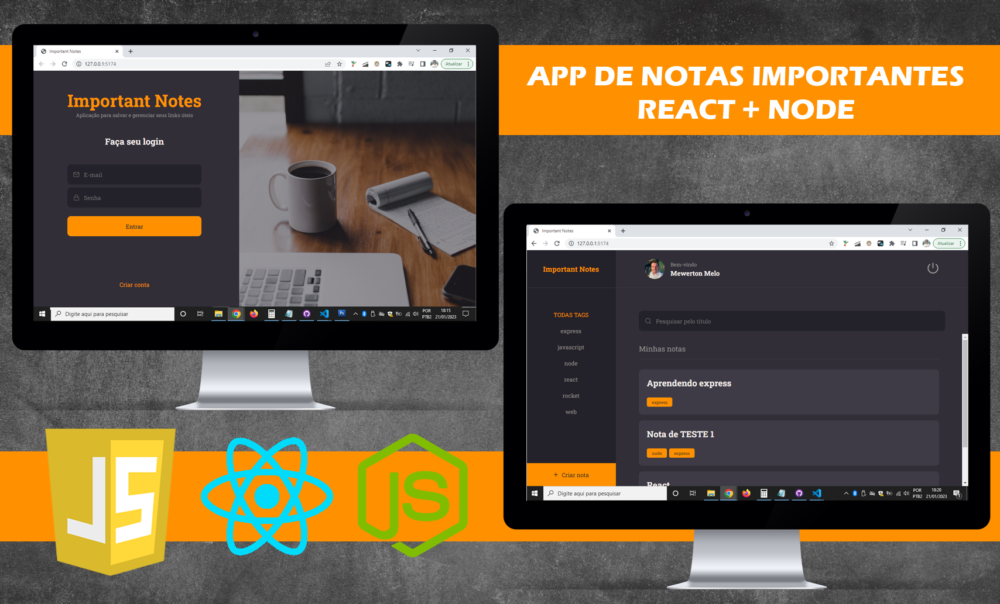

<p align="center">
  <h1 align="center"><a href="#">Important Notes - Rocketseat Explorer :rocket: </a></h1>
</p>

<h4 align="center"> 
	 Status: finalizado
</h4>
<p align="center">
  <h4 align="center"><a href="#">https:...</a></h4>
</p>

<p align="center">
  
</p>

## 💻 Sobre:

A aplicação desenvolvida cria notas com observações sobre algum tema desejado pelo usuário, sendo um bloco de notas digital onde o usuário poderá encontrar facilmente qualquer tema, seja escolhendo pelas Tags ou pesquisando pelo Título.

Neste desafio foram abordados os seguintes temas:

- [ReactJs](https://reactjs.org)
- [Node.js](https://nodejs.org/en/)
- [Javascript](https://developer.mozilla.org/pt-BR/docs/Web/JavaScript)
- [Vite](https://vitejs.dev/)
- [Express](https://expressjs.com)
- [Nodemon](https://nodemon.io/)
- [SQLite](https://www.sqlite.org/index.html)
- [Knex](https://knexjs.org/)
- [BCryptjs](https://www.npmjs.com/package/bcryptjs)
- [JSON Web Token](https://www.npmjs.com/package/jsonwebtoken)
- [Multer](https://www.npmjs.com/package/multer)
- [CORS](https://www.npmjs.com/package/cors)
- [Axios](https://www.npmjs.com/package/axios)
- [Styled Components](https://styled-components.com/)
- [React Icons](https://react-icons.github.io/react-icons/)
- [React Router Dom](https://react-icons.github.io/react-icons/)
---

## 🚀 Como executar o projeto.

### Pré-requisitos

Antes de começar, você vai precisar ter instalado em sua máquina as seguintes ferramentas:
[Node.js](https://nodejs.org/en/). 
Além disto é bom ter um editor para trabalhar com o código como [VSCode](https://code.visualstudio.com/)


### 🚧 Executando o BackEnd (servidor)

```bash
# Faça download do repositório
$ https://github.com/mewerton/ImportantNotes_BackEnd

# Abra seu VS CODE e em seguida abra a pasta do Backend para abrir o projeto
$ cd ImportantNotes_BackEnd

# Instale as dependências necessárias
$ npm install

# Agora inicie o servidor do BackEnd
$ npm run dev

```

### 💻 Executando o FrontEnd

```bash

# Faça download do repositório
$ https://github.com/mewerton/ImportantNotes_FrontEnd

# Abra seu VS CODE e em seguida abra a pasta do Frontend para abrir o projeto
$ ImportantNotes_FrontEnd

# Instale as dependências com:
$ npm install

# Rode a aplicação em modo de desenvolvimento:
$ npm run dev

```
---

## 🛠 Tecnologias

Este projeto foi desenvolvido com as seguintes tecnologias:

- HTML
- CSS
- JavaScript
- Node.js
- React.js

---

## Deploy do projeto.
https:/...


---
